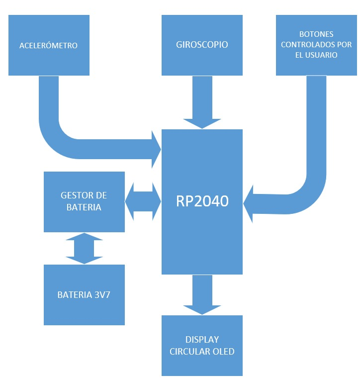

# MarchONs

En este repositorio se planea poner la información y códigos correspondientes al proyecto final de Electrónica Digital 3.

## Descripción del Proyecto

Un reloj inteligente que permita tomar diferentes bio estadísticas, enfocadas al deporte y a la actividad física, mediante el uso de sensores.

Se usará el micro-controlador RP2040 para procesar señales que provienen de sensores como un acelerómetro y giroscopio para medir los pasos por día, un sensor de ritmo cardíaco para dar el pulso, y la señal del RTC (*"Real"* time clock) externo para mostrar la hora en un momento dado.

Estos datos se mostrarán en una pantalla LCD circular, controlada por pulsadores para presentar el dato pedido.

Adicionalmente, se le agregará un modulo para cargar la batería, con un control para evitar la sobrecarga mediante la lectura del valor análogo de la batería.

## Requisitos funcionales

- **Procesamiento de datos:** con diferentes sensores se busca calcular diferentes medidas como se muestra:
  - *Giroscopio y Acelerómetro:* cálculo de pasos mediante una conexión I2C.
  - *Sensor de ritmo cardíaco:* se trabaja con una salida análoga, el muestreo depende de la frecuencia máxima de latidos por minuto, que son 220 latidos por minuto, que serían casi 4 latidos por segundo, por lo que se debe muestrear a un valor similar.
  - *RTC:* con este módulo se plantea seguir la fecha y hora, este maneja una conexión serial, como se cambia cada segundo no se necesita una transmisión de datos de alta velocidad.

- **Alimentación:** se utilizará una batería que en caso de que se esté acabando se podrá recargar, se espera que se tenga una protección contra sobrecargas.

- **Interfaz de Usuario:** se tendrán una pantalla LCD conectada mediante el protocolo SPI para mostrar los datos encontrados, siendo controlada por botones para elegir qué mostrar. Se debe poder configurar para empezar el uso del reloj normal.

## Requisitos NO funcionales

- **Tiempo de respuesta:** se requiere que el tiempo de respuesta sea consecuente con la acción, esto es, que se permita el guardado y despliegue en un tiempo que no sea tan lejano al tiempo de reacción de un humano.
  
- **Usabilidad:** si bien se espera que el reloj sea intuitivo, se planea tener un manual de uso para su correcto funcionamiento y así conocer sus capacidades completas y evitar accidentes.
  
- **Disponibilidad:** se espera que con la batería planeada se tenga por lo media hora de funcionamiento completo (En un modo completo de rendimiento).

## Escenario de Pruebas

En el momento de presentar este proyecto, se plantean las siguientes pruebas para mostrar su correcto funcionamiento:

- Se empieza configurando el reloj (Dando datos del usuario y fecha actual).
- Se muestra el correcto funcionamiento del medidor de pasos, el sensor de ritmo cardíaco y la fecha y hora configuradas a través del display de LCD circular.
- Se apaga para ver si sigue el conteo de la fecha y hora de manera normal y si se guardan los pasos.
- Se muestra el correcto funcionamiento de la carga de la batería, llegando hasta el límite, después, se deja encendido hasta que pasen 30 minutos.

## Presupuesto

Se anexa en la siguiente tabla un presupuesto tentativo incluyendo los componentes principales para el funcionamiento del proyecto final, se tiene un valor comprensible para un grupo de tres personas.

| Elemento                                                               | Valor (\$COP)   |
|:----------------------------------------------------------------------:|:---------------:|
| Placa MCU RP2040 con LCD redondo y sensor de acelerómetro y giroscopio | 93.415          |
| RTC DS1302 Mini                                                        | 5.593           |
| Sensor de ritmo cardíaco                                               | 10.800          |
| Batería Litio-Polímero 3.7v 500mAh                                     | 16.800          |
| Cargador USB tipo C para batería litio - 3.7v                          | 2.856           |
| Conversor ADC - ADS1115                                                | 21.600          |
| Baquela Universal 9x15cm                                               | 3.200           |
| **Total**                                                              | 154.264         |